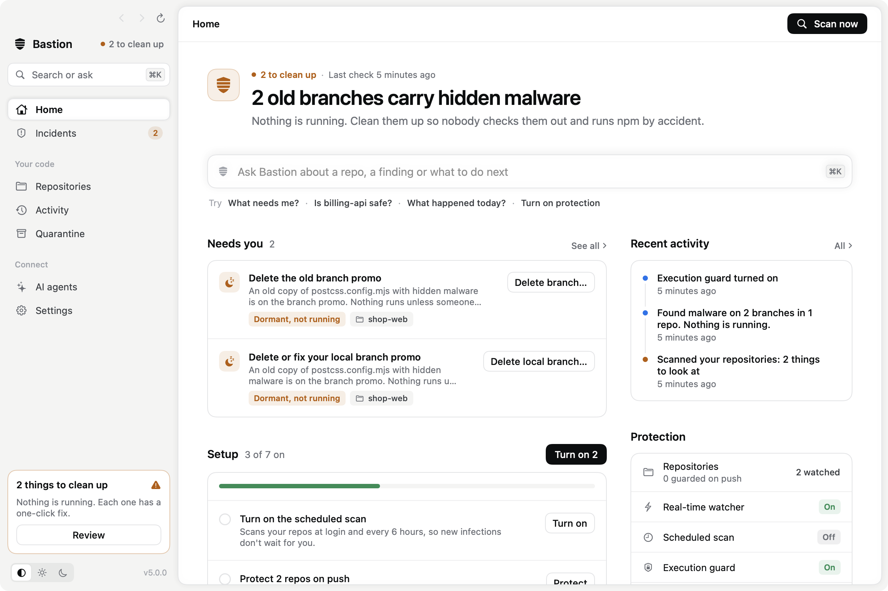
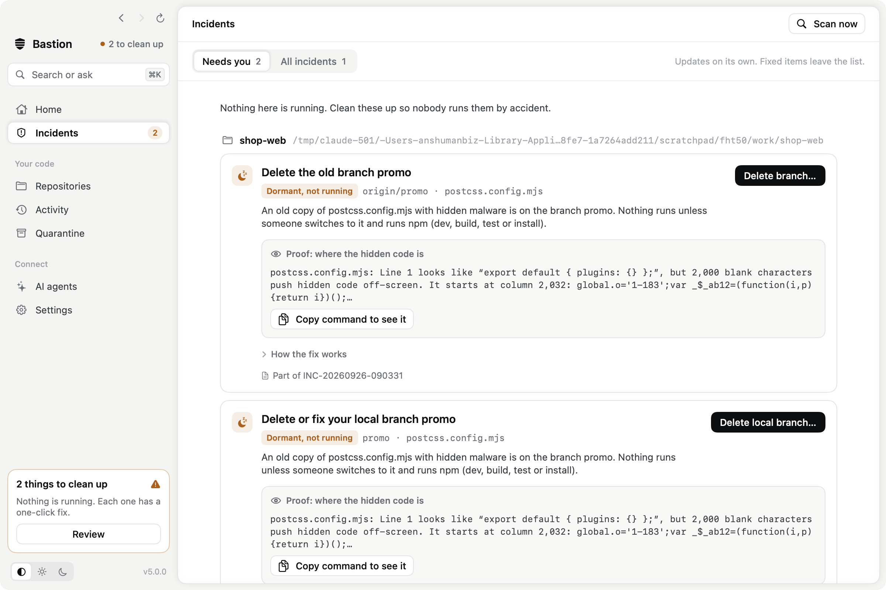
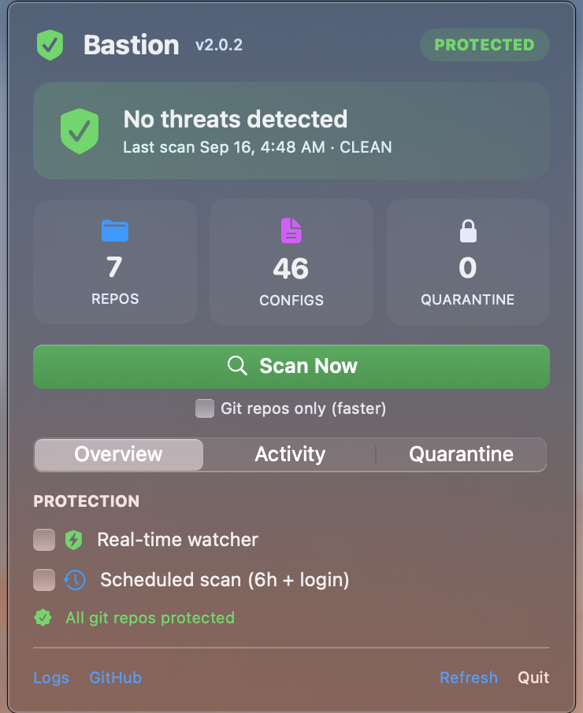

<div align="center">


# Bastion

**An agentic security tool for developers. It stops hidden malware in your JavaScript projects before it runs — and when something gets in, it investigates, contains it and tells you exactly what's left to do.**

A macOS app, a command-line tool and an MCP server for your AI coding agent, in one download.




</div>

## What is it?

Attackers have started hiding malware in the ordinary files of npm/JavaScript projects:

- **config files** like `postcss.config.js` or `vite.config.ts` — the code runs the moment you type `npm run dev`, `build` or `test`
- **install hooks** in `package.json` — the code runs during `npm install`
- **editor tasks** in `.vscode/tasks.json` — the code runs as soon as you open the folder

Once it runs, it quietly steals your tokens, browser sessions and saved passwords, then phones home.

**Bastion is an always-on guard for developers that catches this — and then acts on it.** It spots the
*shape* of the trick rather than one exact virus, so it catches new variants too. When it finds something,
it works the incident the way a security engineer would: which commit brought the payload in and who
committed it, whether it ever ran, which branches carry it, what else that identity touched. Then it fixes
what it can prove and hands you a short to-do list for the rest.

## Why you'd want it

- 🛡️ **Blocks it before it runs** — refuses to start a dev server or an install when a project has been tampered with.
- 🧠 **Responds on its own** — investigates, removes injected code it can prove the attacker added, stops loaders, quarantines leftovers and blocks attacker servers.
- 📋 **Tells you exactly what needs you** — one live list with proof (the line and column where the hidden code sits, a GitHub link, a command to see it yourself) and the fix that fits each item, one click away. Items leave the list when Bastion sees them fixed.
- 📦 **Checks your dependencies** — install scripts deep in `node_modules`, lockfiles that pull packages from odd servers, and (if you opt in) the osv.dev list of known malicious packages.
- 🕵️ **Hunts through git history** — finds a payload on any branch, in the reflog, or left over from a deleted branch, and names the commit and identity that planted it.
- 👥 **Guards your team** — a GitHub Action fails any pull request that carries a payload, so it never reaches `main`.
- 🤖 **Keeps your AI agent safe too** — agents ask Bastion "is this repo safe to run?" before `npm install` or `npm run dev`, and a hard-guard hook stops Claude Code or Cursor from running them in an unsafe repo at all.
- ↩️ **Never destructive** — nothing is deleted, every file change has an undo, and commits, pushes and access changes are always left to you.
- 🧘 **Doesn't cry wolf** — an allowlist for your own servers and an ignore list for docs and tests keep false alarms away.

## Install

**Easiest:** download `Bastion.dmg` from the [latest release](https://github.com/realanshuman/bastion/releases),
open it, drag **Bastion** to Applications and launch it. On first open, right-click the app → **Open**
(it's open-source and self-signed). The first launch sets everything up in `~/.security-guard`,
including the `bastion` command.

**From source:**
```bash
git clone https://github.com/realanshuman/bastion.git
cd bastion
bash build.sh      # builds Bastion.app, the bastion CLI and a .dmg
bash install.sh    # turns on the background protection
```

**Where to find it afterwards**

- The 🛡 shield sits in your menu bar, at the top-right of the screen. Click it for a quick look; click
  **Open** for the full window.
- The `bastion` command lives at `~/.security-guard/bin/bastion`. To type just `bastion`, add it to your PATH once:
  ```bash
  echo 'export PATH="$HOME/.security-guard/bin:$PATH"' >> ~/.zshrc
  ```

## How Bastion responds

When the watcher or a scan finds something, Bastion's responder runs on its own:

1. **Investigate** — a fresh scan, then git history for every infected file: the last clean version, the
   commit and identity that planted the payload, and every branch (local and pushed) that carries it.
   It checks whether the payload ran (leftovers on disk, killed loaders, the payload in a build cache) and
   hunts for other commits by the same identity across all your repos.
2. **Contain** — only steps it can prove and undo:
   - removes the injected code, but only when the file then matches its last clean commit **byte for byte**
     (a copy of the infected file is kept; `bastion undo` puts it back);
   - stops loaders, and dev servers that started after the payload arrived;
   - quarantines leftovers (moved aside, never deleted);
   - blocks attacker addresses found in the payload itself.
3. **Verify** — scans again to confirm.
4. **Report** — an incident with what happened, whether it ran, what Bastion did, and your to-dos with the
   exact commands.

<div align="center"></div>

It will **never** commit, push, delete a branch, change anyone's access or touch a file with your own
unsaved edits in it — those become to-dos. Choose how much it does on its own in **Settings → Auto-respond**:
**Contain** (default), **Observe** (investigate and report only) or **Off**.

## The app

- **One status everywhere** — *All clear*, *N things to clean up* (nothing is running) or *Act now*, the same in the
  window, the sidebar, the menu-bar panel and its icon.
- **Menu-bar panel** — a quick look: status, what needs you, and switches for each protection.
- **The window** — everything else, in a keyboard-first layout:
  - **Overview** — the status, a **Next steps** checklist for the setup that's still open (turn on protections in
    one click, protect husky repos on push, connect your agents), and every protection switch.
  - **Incidents → Needs you** — the live list: every threat, infected branch and open step, grouped by repo, each
    with how dangerous it is right now, the proof and a fix button (anything that changes GitHub asks first).
  - **Incidents → All incidents** — each one opens into the investigation, to-dos that tick themselves off as
    Bastion sees them fixed, and the timeline.
  - **Repositories** — every git repo, its health, push guard and infected branches; check one, hunt its
    history, check its dependencies or add the Team PR guard from the **⋯** menu.
  - **Activity** — everything Bastion caught, blocked or changed, by day.
  - **Quarantine**, **AI agents** (which agents are connected, one-click connect, the hard-guard) and **Settings**
    (auto-respond, protections, the online malware check, your lists).
  - **⌘K** opens the command menu; **⌘1–7** jump between pages.

<div align="center"></div>

## Dependency guard

Every install — by you, a script or an agent — is checked first. Bastion looks at:

- **install scripts in `node_modules`** — a `preinstall`/`postinstall` that downloads and runs code, or
  runs a file that carries a payload or a known worm's markers;
- **your lockfile** — packages resolved from plain `http://` or a raw IP address instead of a registry;
- **known malicious versions** (opt-in) — your exact package versions are compared with the
  [osv.dev](https://osv.dev) malicious-package list. Only package names and versions are sent, never your code.
  Turn it on in **Settings** or with `bastion osv on`.

```bash
bastion deps              # check this project's dependencies (--online adds the osv.dev check once)
```

## Git history hunt

A clean working tree doesn't mean a clean repo. `bastion history` searches every commit on every branch,
the reflog and objects left over from deleted branches for a planted payload, and tells you which commit
brought it in, who committed it and which branches still carry it. `bastion branches` lists the local and
pushed branches whose configs are infected, so you don't merge or check one out by accident.

## Team PR guard

Protect everyone who clones the repo, not just your Mac. Add this workflow (or run
`bastion ci-setup --write`) and every pull request is checked on GitHub:

```yaml
# .github/workflows/bastion.yml
name: Bastion
on:
  pull_request:
  push:
    branches: [main, master]
permissions:
  contents: read
jobs:
  bastion:
    runs-on: ubuntu-latest
    steps:
      - uses: actions/checkout@v4
      - uses: realanshuman/bastion@v4
```

A finding fails the check and is annotated on the exact file. False alarms go in a `.bastionignore` file,
which is read from the **base** branch, so a pull request can't silence its own findings.

## Use it with AI agents

Bastion is an [MCP](https://modelcontextprotocol.io) server, so any agent that speaks MCP can use it.

**Claude Code** — run this once:
```bash
claude mcp add --scope user bastion -- ~/.security-guard/bin/bastion mcp
```

**Cursor, Claude Desktop, Windsurf** — add Bastion to the `mcpServers` section of the app's MCP config
(for Cursor that's `~/.cursor/mcp.json`). Use your full home path; the **AI agents** page shows it for you:
```json
{ "mcpServers": { "bastion": { "command": "/Users/you/.security-guard/bin/bastion", "args": ["mcp"] } } }
```

**Codex CLI** — in `~/.codex/config.toml`:
```toml
[mcp_servers.bastion]
command = "/Users/you/.security-guard/bin/bastion"
args = ["mcp"]
```

Once it's connected, your agent is told to check a repository before running `install`, `dev`, `build`,
`test` or codegen in it, and to hand anything suspicious to Bastion's responder.

| Tool | What it does |
| --- | --- |
| `bastion_check_path` | "Is it safe to run npm here?" — checks one project, usually in under a second |
| `bastion_respond` | Investigates, contains what it can prove (with undo) and returns an incident report |
| `bastion_incidents` · `bastion_incident` | Incident history and full reports |
| `bastion_todos` | Everything that needs the user right now, with proof and the fix — agents show it, the user runs it |
| `bastion_deps` · `bastion_history` | Checks a project's dependencies · hunts a repo's git history for planted payloads |
| `bastion_status` | Is this Mac protected right now? |
| `bastion_scan` | Sweeps every repo plus temp folders, processes and network |
| `bastion_findings` · `activity` · `quarantine` · `lists` | Everything else Bastion knows, read-only |
| `bastion_enable` | Turns a protection **on** (watcher, scheduled scan, execution guard, git push guard, auto-respond) |
| `bastion_block_indicator` | Blocks an attacker address — only when an incident found it in malware on this Mac |

**Agents can make you safer, never less safe.** There's no tool to switch protection off, trust a host,
ignore a path, unblock an address or restore quarantined files, so a confused or tricked agent can't do
those things either. They're yours, and they ask you to confirm. Every change is logged and announced.

**Hard-guard.** MCP asks an agent to check first; a hook makes it. Bastion adds a hook that runs before
every shell command the agent starts, and blocks `install`, `dev`, `build` or `test` in a project that isn't
safe — the agent is told why and what to do instead:

```bash
bastion hooks install claude    # Claude Code (~/.claude/settings.json) · "cursor" for Cursor · "all"
bastion hooks status
```

Your existing settings are kept (a backup is saved next to the file), and the hook never approves anything
on its own — commands still go through the agent's normal permission prompts.

> Honest note: an agent that can run shell commands has your permissions and could, in principle, remove
> Bastion itself. Bastion makes lowering protection explicit and loud rather than impossible.

## Command line

```bash
bastion status                  # is this Mac protected right now?
bastion check                   # is it safe to run install/dev/build in this folder?
bastion scan                    # scan all your git repos (--full scans your whole home folder)
bastion todos                   # what needs you right now, with proof and the fix for each
bastion fix <id>                # run an item's fix (--yes for anything that changes GitHub or deletes)
bastion next                    # setup that's still open · bastion agents: which AI agents are connected
bastion respond                 # investigate and contain an attack (--plan: investigate only)
bastion incidents               # incident history · incident [id] shows the report
bastion undo [id]               # put back files Bastion cleaned, if it got one wrong
bastion autonomy observe        # contain (default) · observe · off
bastion repos                   # your git repos: branch, push guard, open findings
bastion deps                    # check this project's dependencies (osv on: also known malicious versions)
bastion history                 # hunt every branch, the reflog and deleted branches for payloads
bastion branches                # local and pushed branches whose configs are infected
bastion hooks install claude    # hard-guard Claude Code (or cursor, all)
bastion connect cursor --write  # add Bastion to Cursor's MCP config (also claude_desktop, windsurf, codex)
bastion enable git-guard --husky ~/code/app   # add the push check to a husky repo's .husky/pre-push
bastion ci-setup --write        # add the Team PR guard workflow to this repo
bastion activity                # what Bastion caught or changed recently
bastion enable watcher          # or schedule, exec-guard, git-guard, auto-respond; "disable" turns one off
bastion allow add api.mycompany.com   # trust your own server
```

Add `--json` to any command for machine-readable output. Exit codes: `0` all good · `2` threats found ·
`1` error, so `bastion check && npm install` works in scripts and CI.

## Make it yours

Bastion reads three small text files in `~/.security-guard/`. Edit them in **Settings**, directly, or with the commands:

- **`allowlist.txt`** — your own servers and APIs, so their traffic is never mistaken for a threat (`bastion allow add …`).
- **`blocklist.txt`** — known-bad IP addresses; ships with known attacker servers (`bastion block add …`).
- **`ignore.txt`** — files that only *mention* malware signatures, like security docs or tests (`bastion ignore add …`).
  A build config is only skipped when its exact full path is listed, so a broad entry can't hide a real threat.

One entry per line; `#` starts a comment. Updates never overwrite your lists; new known-bad addresses are merged in.

## How it works (four layers)

1. **Prevent** — command guards refuse to run `dev`, `build` or `install` in a tampered project, and a git
   hook blocks pushing an infected config.
2. **Detect & stop** — a watcher checks every ~12 seconds, kills malware loaders and connections to known
   attacker servers, and quarantines what they leave behind.
3. **Respond** — the responder investigates, contains what it can prove and writes the incident report.
4. **Scan** — a structural scan of your projects (config files, source files, `package.json` install hooks,
   `.vscode` auto-run tasks, dependencies, CI workflows and every branch) on demand, at login and every few hours.

Everything runs on your Mac. Nothing is uploaded — unless you turn on the online malware check, which sends
package names and versions only.

## Honest limits

- It's a **focused guard** for this family of supply-chain attacks and the mess they leave, not a full
  antivirus. Keep a general scanner around too.
- The dependency guard catches malicious **install scripts**, odd **download sources** and (with osv.dev on)
  **known** malicious versions. A brand-new package that hides its payload in ordinary library code can still
  get through; `npm install --ignore-scripts` is the belt-and-braces option.
- It protects **your machine**. If malicious code keeps arriving in a shared repo, fix it at the source —
  the incident's to-dos show you where.
- It's **self-signed**, so the first launch shows an "unidentified developer" prompt (right-click → Open gets past it).

## Uninstall

```bash
bash ~/.security-guard/uninstall.sh            # stop the background guard, keep the app
bash ~/.security-guard/uninstall.sh --purge    # remove everything
```

If you connected an agent, remove it there too (Claude Code: `claude mcp remove bastion`), and run
`bastion hooks remove all` first if you added the hard-guard.

## License

MIT — see [LICENSE](LICENSE). Contributions welcome.
